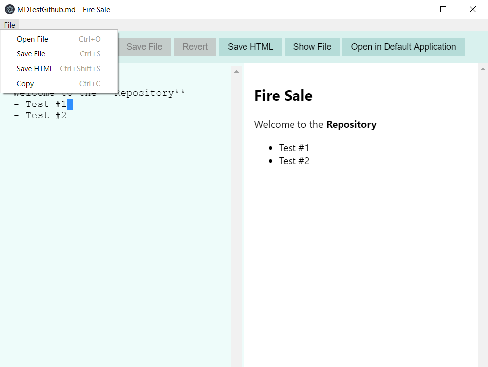
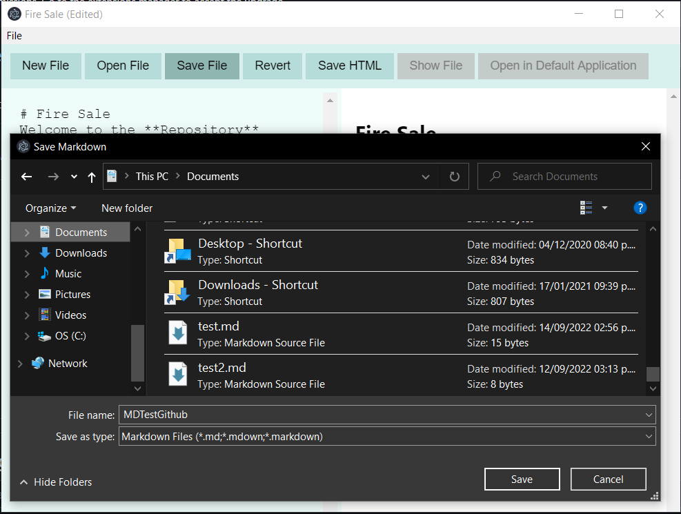
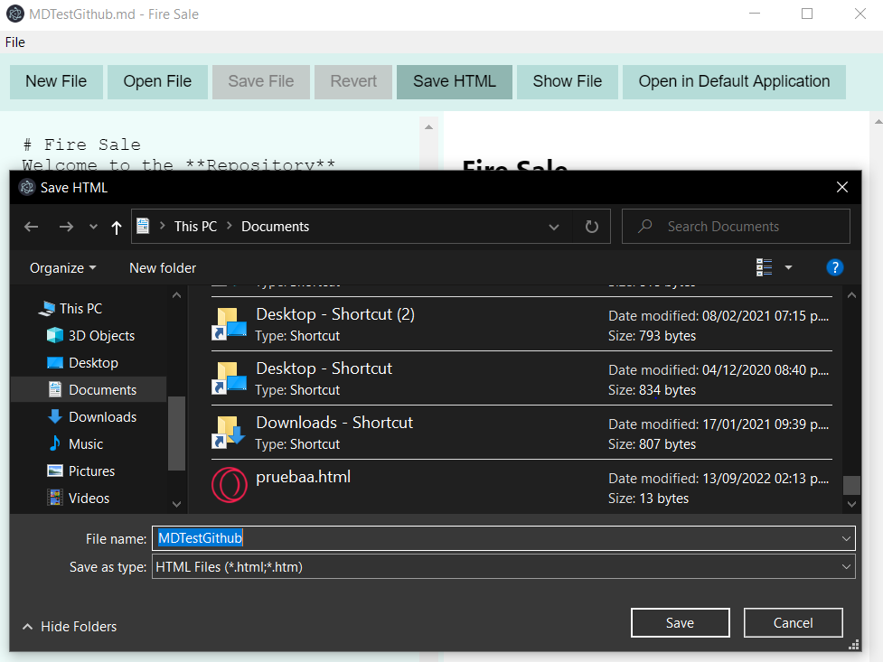
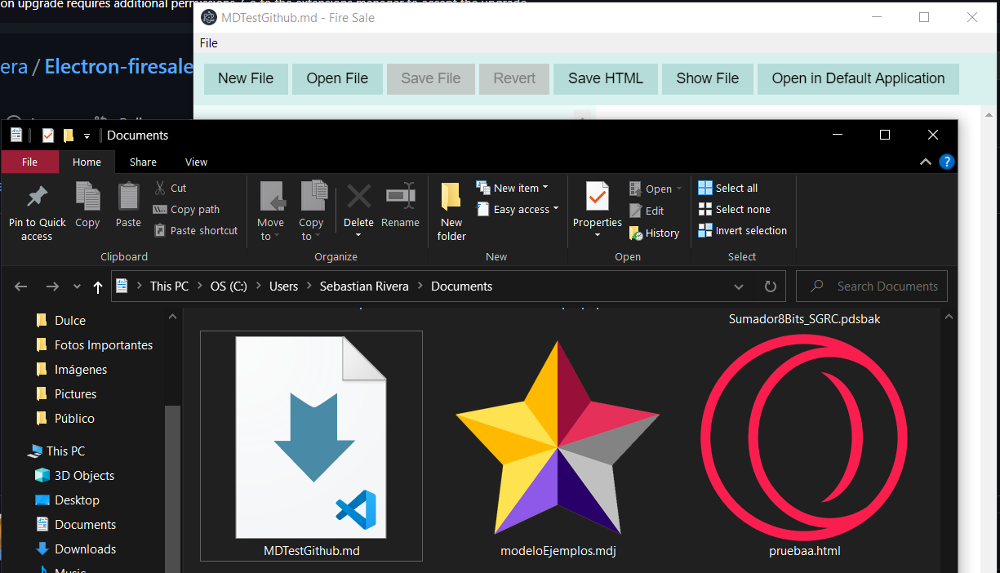
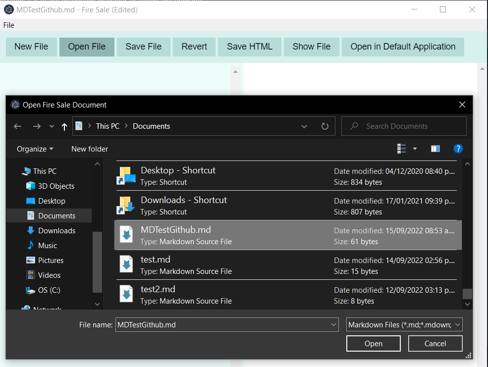
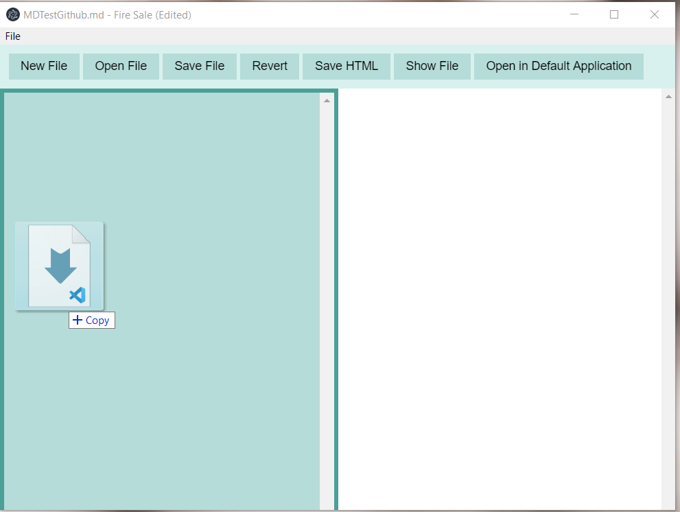
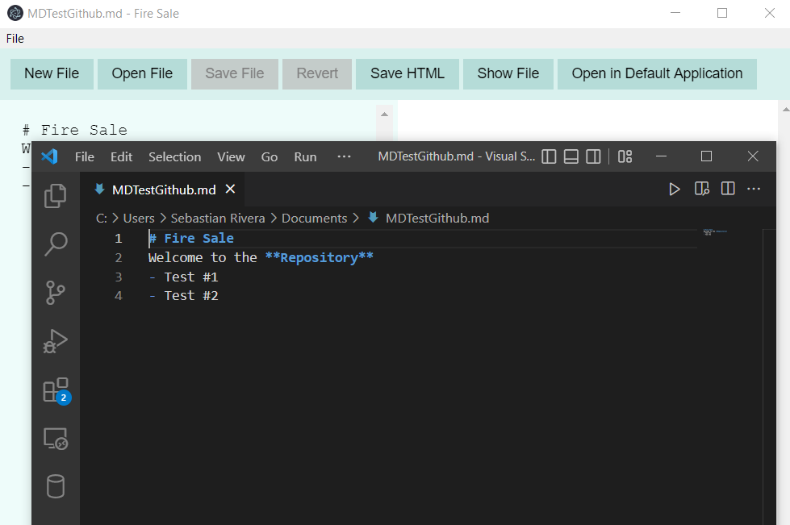

# Fire Sale

First project from FrontEnd Masters Electron Course [Electron Fundamentals v2](https://frontendmasters.com/courses/electron-v2).
Original Repository for the project: [firesale-fem-v2](https://github.com/electron-in-action/firesale-fem-v2).

- Main Screen of the Desktop Application

- File Menu on Application

- Save File (Markdown)
 
 
 - Save File (HTML)
 
 
 - Show File in its Location
 
 
 - Open Markdown or Text File
 
 
 - Drag N' Drop File in Application
 
 
 - Open File in Default Text Editor (VSCode in my case)
 
